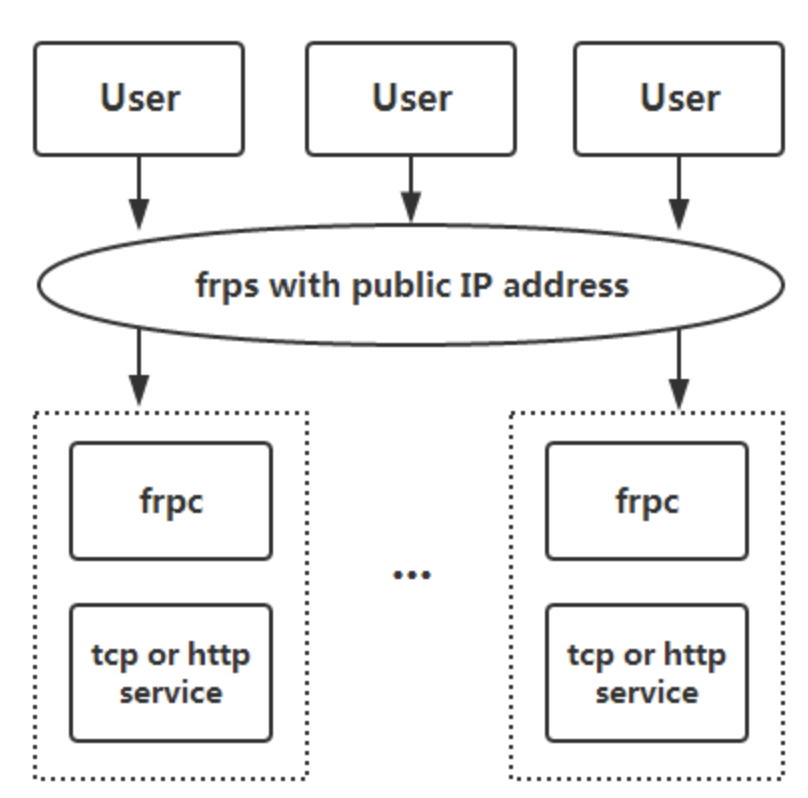

# frq实现内网穿透
## frq简介
> frp 是一个专注于内网穿透的高性能的反向代理应用，支持 TCP、UDP、HTTP、HTTPS 等多种协议，且支持 P2P 通信。可以将内网服务以安全、便捷的方式通过具有公网 IP节点的中转暴露到公网。后端采用go,管理面板使用vue.
> 
> Github官网:https://github.com/fatedier/frp
## 实现原理图


## 需求
需要一台具有公共IP的服务器,以及客户端(需要穿透的电脑)

## 服务器端(frps)
1. 下载指定的发行版压缩包解压
2. 修改`frps.toml`文件
   ```toml
   # frps.toml
   # 内网映射到服务器端的端口
   bindPort = 7000 

   #访问客户端web服务自定义的端口号
   vhostHTTPPort = 5173 
   ```
3. 运行`frp`服务
   ```zsh
   ./frps -c ./frps.toml
    ```


## 客户端(frpc)
1. 下载指定的发行版压缩包解压
2. 修改`frpc.toml`文件
   ```toml
   serverAddr = "47.97.170.198"
   serverPort = 7000
   
   [[proxies]]
   name = "HoGo Music"
   type = "http"
   # localIP = "127.0.0.1"

   # 绑定的域名,需要云服务器配置过域名解析
   customDomains = ["cscoder.top"]

   # 本地web应用端口
   localPort = 5173
   # remotePort = 6000
  ```
3. 启动`frpc`服务
   ```zsh
   ./frpc -c ./frpc.toml
   ```